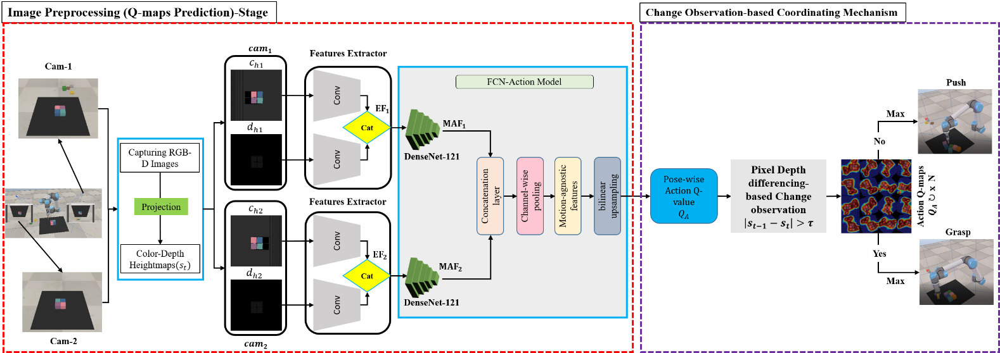

# Deep Reinforcement Learning-Based Robotic Grasping in Clutter and Occlusion

## Summary
In this paper, two significant challenges associated with robotic grasping in both clutter and occlusion scenarios are addressed. The first challenge is the coordination of push and grasp actions, in which the robot may occasionally fail to disrupt the arrangement of the objects in a well-ordered object scenario. On the other hand, when employed in a randomly cluttered object scenario, the pushing behavior may be less efficient, as many objects are more likely to be pushed out of the workspace. The second challenge is the avoidance of occlusion that occurs when the camera itself is entirely or partially occluded during a grasping action. This paper proposes a multi-view change observation-based approach (MV-COBA) to overcome these two problems. The proposed approach is divided into two parts:
1. Using multiple cameras to set up multiple views to address the occlusion issue.
2. Using visual change observation on the basis of the pixel depth difference to address the challenge of coordinating push and grasp actions.

According to experimental simulation findings, the proposed approach achieved an average grasp success rate of 83.6%, 86.3%, and 97.8% in the cluttered, well-ordered object, and occlusion scenarios, respectively.

## Approach 


## Setting and Installation
This implementation has the following dependencies, which have been tested on Ubuntu 19.04.4 LTS:

- **Python**: 2.7 or 3
- **NumPy, SciPy, OpenCV, Matplotlib**: Easily install/update these dependencies by executing the following command (use pip3 instead of pip for Python 3 or conda):
  ```bash
  conda install -c anaconda numpy scipy opencv matplotlib

## Requirements
This project can be run on a GPU with 4GB memory or on a CPU. However, note that running on a CPU will significantly increase the time required for each iteration.

### PyTorch version 1.0+
To install PyTorch, run the following commands:
    ```bash
    pip install torch==0.3.1 torchvision==0.2.0
    pip install torch torchvision

### V-REP (CoppeliaSim)
    This project requires the V-REP (CoppeliaSim) simulation environment. You can download it here.


## Training Scenario
### Using GPU
    '''bash
    python main.py --is_sim --obj_mesh_dir objects/blocks --grasp_rewards --experience_replay --save_visualizations

### Using CPU
    '''bash
    python main.py --is_sim --obj_mesh_dir objects/blocks --grasp_rewards --experience_replay --save_visualizations --cpu


## Test Scenario
### Well-Order (1-2 two objects, 3-5 six objects)
    '''bash
    python main.py --is_sim --obj_mesh_dir 'objects/blocks' --num_obj 10 --grasp_rewards --experience_replay --explore_rate_decay --is_testing --test_preset_cases --test_preset_file 'simulation/test-cases/TCWO1' --load_snapshot --snapshot_file 'logs/train/models/snapshot-backup.reinforcement.pth' --save_visualizations --push

    python main.py --is_sim --obj_mesh_dir 'objects/blocks' --num_obj 10 --grasp_rewards --experience_replay --explore_rate_decay --is_testing --test_preset_cases --test_preset_file 'simulation/test-cases/TCWO2' --load_snapshot --snapshot_file 'logs/train/models/snapshot-backup.reinforcement.pth' --save_visualizations --push

    python main.py --is_sim --obj_mesh_dir 'objects/blocks' --num_obj 30 --grasp_rewards --experience_replay --explore_rate_decay --is_testing --test_preset_cases --test_preset_file 'simulation/test-cases/TCWO3' --load_snapshot --snapshot_file 'logs/train/models/snapshot-backup.reinforcement.pth' --save_visualizations --push

    python main.py --is_sim --obj_mesh_dir 'objects/blocks' --num_obj 30 --grasp_rewards --experience_replay --explore_rate_decay --is_testing --test_preset_cases --test_preset_file 'simulation/test-cases/TCWO4' --load_snapshot --snapshot_file 'logs/train/models/snapshot-backup.reinforcement.pth' --save_visualizations --push

    python main.py --is_sim --obj_mesh_dir 'objects/blocks' --num_obj 30 --grasp_rewards --experience_replay --explore_rate_decay --is_testing --test_preset_cases --test_preset_file 'simulation/test-cases/TCWO5' --load_snapshot --snapshot_file 'logs/train/models/snapshot-backup.reinforcement.pth' --save_visualizations --push


### Random Order (1-2 two objects, 3-5 six objects)
    '''bash
    python main.py --is_sim --obj_mesh_dir 'objects/blocks' --num_obj 20 --grasp_rewards --experience_replay --explore_rate_decay --is_testing --test_preset_cases --test_preset_file 'simulation/test-cases/TCRO1' --load_snapshot --snapshot_file 'logs/train/models/snapshot-backup.reinforcement.pth' --save_visualizations --push

    python main.py --is_sim --obj_mesh_dir 'objects/blocks' --num_obj 30 --grasp_rewards --experience_replay --explore_rate_decay --is_testing --test_preset_cases --test_preset_file 'simulation/test-cases/TCRO2' --load_snapshot --snapshot_file 'logs/train/models/snapshot-backup.reinforcement.pth' --save_visualizations --push

    python main.py --is_sim --obj_mesh_dir 'objects/blocks' --num_obj 30 --grasp_rewards --experience_replay --explore_rate_decay --is_testing --test_preset_cases --test_preset_file 'simulation/test-cases/TCRO3' --load_snapshot --snapshot_file 'logs/train/models/snapshot-backup.reinforcement.pth' --save_visualizations --push

    python main.py --is_sim --obj_mesh_dir 'objects/blocks' --num_obj 30 --grasp_rewards --experience_replay --explore_rate_decay --is_testing --test_preset_cases --test_preset_file 'simulation/test-cases/TCRO4' --load_snapshot --snapshot_file 'logs/train/models/snapshot-backup.reinforcement.pth' --save_visualizations --push

    python main.py --is_sim --obj_mesh_dir 'objects/blocks' --num_obj 30 --grasp_rewards --experience_replay --explore_rate_decay --is_testing --test_preset_cases --test_preset_file 'simulation/test-cases/TCRO5' --load_snapshot --snapshot_file 'logs/train/models/snapshot-backup.reinforcement.pth' --save_visualizations --push

### Occlusion Scenario
    '''bash
    python main.py --is_sim --obj_mesh_dir 'objects/blocks' --num_obj 4 --grasp_rewards --experience_replay --explore_rate_decay --is_testing --test_preset_cases --test_preset_file 'simulation/test-cases/CT8' --load_snapshot --snapshot_file 'logs/train/models/snapshot-backup.reinforcement.pth' --save_visualizations --push

    python main.py --is_sim --obj_mesh_dir 'objects/blocks' --num_obj 9 --grasp_rewards --experience_replay --explore_rate_decay --is_testing --test_preset_cases --test_preset_file 'simulation/test-cases/CT10' --load_snapshot --snapshot_file 'logs/train/models/snapshot-backup.reinforcement.pth' --save_visualizations --push

    python main.py --is_sim --obj_mesh_dir 'objects/blocks' --num_obj 10 --grasp_rewards --experience_replay --explore_rate_decay --is_testing --test_preset_cases --test_preset_file 'simulation/test-cases/CT12' --load_snapshot --snapshot_file 'logs/train/models/snapshot-backup.reinforcement.pth' --save_visualizations

## Evaluation
### Well-Order (1-2 two objects, 3-5 six objects)
    '''bash
    python evaluate.py --session_directory 'logs/TCWO1' --method 'reinforcement' --num_obj_complete 6
    python evaluate.py --session_directory 'logs/TCWO2' --method 'reinforcement' --num_obj_complete 10
    python evaluate.py --session_directory 'logs/TCWO3' --method 'reinforcement' --num_obj_complete 17
    python evaluate.py --session_directory 'logs/TCWO4' --method 'reinforcement' --num_obj_complete 11
    python evaluate.py --session_directory 'logs/TCWO5' --method 'reinforcement' --num_obj_complete 10

### Random Order (1-2 two objects, 3-5 six objects)
    '''bash
    python evaluate.py --session_directory 'logs/TCRO1' --method 'reinforcement' --num_obj_complete 20
    python evaluate.py --session_directory 'logs/TCRO2' --method 'reinforcement' --num_obj_complete 30
    python evaluate.py --session_directory 'logs/TCRO3' --method 'reinforcement' --num_obj_complete 30
    python evaluate.py --session_directory 'logs/TCRO4' --method 'reinforcement' --num_obj_complete 30
    python evaluate.py --session_directory 'logs/TCRO5' --method 'reinforcement' --num_obj_complete 14

## Plotting Results
    '''bash
    python plot.py 'logs/train'
    python evaluate.py --session_directory 'logs/train' --method 'reinforcement' --num_obj_complete


